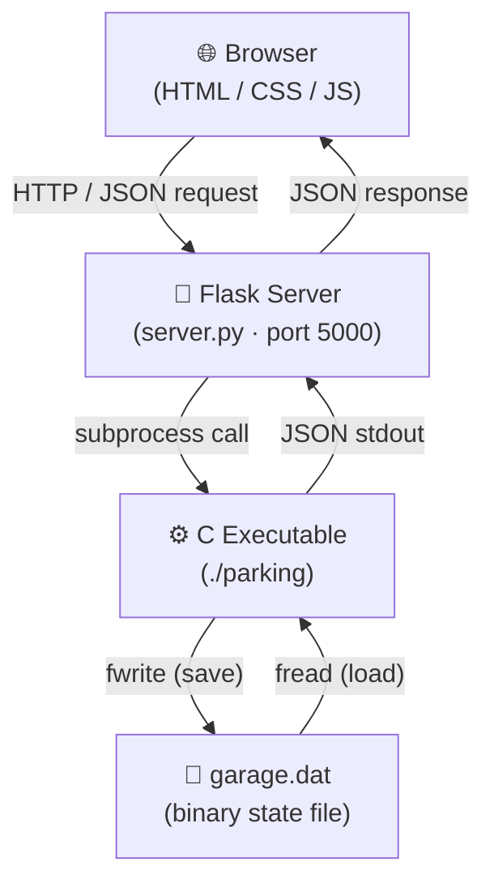

# 🅿️ Multi-Level Parking Garage Management System

A full-stack parking garage simulator with a **C backend** (all data structures hand-rolled — no STL), a **glassmorphism web frontend** (HTML/CSS/JS), and a **Python Flask bridge** connecting them.

> **60 slots · 3 floors · 5 data structures · 33 unit tests · 12 API endpoints**

---

## Architecture



**Why this design?**

- The C code stays **pure** — zero networking, zero HTTP parsing. Just data structures and algorithms.
- Flask acts as a **thin bridge** (~100 lines): receives HTTP requests, calls the C executable via `subprocess`, and returns its JSON stdout.
- State persists in a **binary file** (`garage.dat`) so every subprocess call is stateless, but the garage remembers everything between requests.

---

## Data Structures

| # | Structure | Source Files | Purpose | Key Operations |
|---|-----------|-------------|---------|----------------|
| 1 | **Circular Queue** | `circular_queue.c/h` | Tracks available slot indices per floor. Dequeue = park, enqueue = free. Wraps around for efficient reuse. | `enqueue` · `dequeue` — O(1) |
| 2 | **Min-Heap Priority Queue** | `priority_queue.c/h` | VIP-prioritised waitlist. When full, vehicles queue by priority (VIP > Reserved > Regular) with FIFO tie-breaking. | `insert` · `extract_min` — O(log n) |
| 3 | **Stack** (Linked List) | `stack.c/h` | Exit-lane LIFO simulation. Models a single-lane exit where only the last car in can leave first. | `push` · `pop` · `peek` — O(1) |
| 4 | **Singly Linked List** | `linked_list.c/h` | Chronological activity log. Every park/exit event is appended at the tail. | `append` — O(1) |
| 5 | **Hash Table** (DJB2 + Chaining) | `hash_table.c/h` | License plate → parking location lookup. DJB2 hash with 101 buckets and separate chaining. | `insert` · `lookup` · `delete` — O(1) avg |

---

## Project Structure

```
parking-garage/
├── backend/
│   ├── include/              # Header files (8)
│   │   ├── circular_queue.h
│   │   ├── priority_queue.h
│   │   ├── stack.h
│   │   ├── linked_list.h
│   │   ├── hash_table.h
│   │   ├── garage.h          # Core orchestration layer
│   │   ├── billing.h
│   │   └── json_helpers.h
│   ├── src/                  # Implementation files (9)
│   │   ├── circular_queue.c
│   │   ├── priority_queue.c
│   │   ├── stack.c
│   │   ├── linked_list.c
│   │   ├── hash_table.c
│   │   ├── garage.c          # Ties all 5 structures together
│   │   ├── billing.c         # Tiered rate calculator
│   │   ├── json_helpers.c    # Zero-dependency JSON builder
│   │   └── main.c            # CLI dispatcher (10 commands)
│   ├── tests/
│   │   └── test_all.c        # 33 unit tests
│   └── Makefile
├── frontend/
│   ├── index.html            # Dashboard layout
│   ├── css/style.css         # Glassmorphism design system
│   └── js/
│       ├── api.js            # Fetch-based API client
│       ├── components.js     # Pure UI renderers
│       └── app.js            # Controller + event binding
├── server.py                 # Flask subprocess bridge
├── requirements.txt          # flask
└── .gitignore
```

---

## Quick Start

### Prerequisites

- **GCC** (or any C compiler)
- **Python 3** + **pip**

### 1. Build the Backend

```bash
cd backend
make
```

### 2. Run Unit Tests

```bash
make test
# Expected: 33 passed, 0 failed
```

### 3. Install Flask & Start Server

```bash
cd ..
pip3 install -r requirements.txt
python3 server.py
```

### 4. Open the Dashboard

Navigate to **http://localhost:5000**

---

## CLI Reference

The C executable works standalone — no server needed:

```bash
cd backend

./parking status                 # Garage overview (JSON)
./parking park ABC123 0          # Park regular vehicle
./parking park VIP001 1          # Park VIP vehicle
./parking lookup ABC123          # Find vehicle location
./parking exit ABC123            # Exit with billing
./parking log                    # Recent activity log
./parking exitlane_push XYZ789   # Push into exit lane
./parking exitlane_view          # View exit lane (LIFO)
./parking exitlane_pop           # Pop + process exit
./parking waitlist               # View waitlist
./parking reset                  # Reset to empty state
```

All commands output JSON to stdout.

---

## API Endpoints

| Method | Endpoint | Description |
|--------|----------|-------------|
| `GET`  | `/api/status` | Garage overview (floors, stats) |
| `POST` | `/api/park` | Park a vehicle `{plate, is_vip}` |
| `POST` | `/api/exit` | Exit a vehicle `{plate}` |
| `GET`  | `/api/lookup?plate=X` | Find vehicle location |
| `GET`  | `/api/log` | Recent 20 activity entries |
| `POST` | `/api/exitlane_push` | Push to exit lane |
| `POST` | `/api/exitlane_pop` | Pop from exit lane + billing |
| `GET`  | `/api/exitlane_view` | View exit lane contents |
| `GET`  | `/api/waitlist` | View waitlist entries |
| `POST` | `/api/reset` | Reset garage to empty |

---

## Billing Rates

| Duration | Rate |
|----------|------|
| First 30 minutes | Free |
| 30 min – 2 hours | $3.00/hour |
| 2 – 6 hours | $5.00/hour |
| 6+ hours | $8.00/hour |
| **VIP discount** | **20% off** |
| **Daily cap** | **$40.00 max** |

---

## Configuration

Default: **3 floors × 20 slots = 60 total**

Edit `backend/include/garage.h` to change:

```c
#define NUM_FLOORS      3
#define SLOTS_PER_FLOOR 20
```

---

## Testing

| Module | Tests | Status |
|--------|-------|--------|
| Circular Queue | 6 | ✅ Pass |
| Priority Queue | 5 | ✅ Pass |
| Stack | 4 | ✅ Pass |
| Linked List | 4 | ✅ Pass |
| Hash Table | 6 | ✅ Pass |
| Billing | 7 | ✅ Pass |
| **Total** | **33** | **✅ All Pass** |

Compiled with `gcc -Wall -Wextra` — **zero warnings**.

---

## License

MIT — built as a portfolio and educational project.
